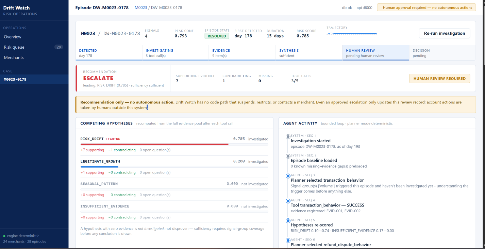
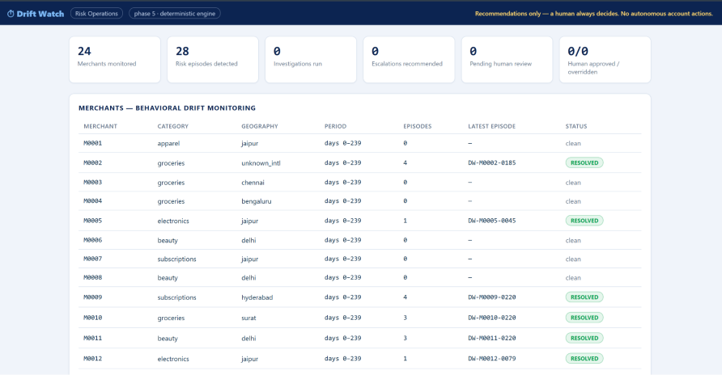

# Drift Watch

**Continuous post-onboarding merchant risk-drift detection and evidence-based investigation.**

A buildathon prototype for the Razorpay AI Buildathon 2026, AI Risk Manager track. Drift Watch is an independent project inspired by publicly documented fintech risk-engineering problems. It uses synthetic merchant data and does not use private Razorpay data, systems, or production infrastructure.

> **Safety boundary:** Drift Watch produces recommendations only. It does not suspend, restrict, contact, or otherwise take autonomous action on a merchant account. Every escalation requires an explicit human decision.

## Overview

Merchant risk does not end at onboarding. A merchant can pass initial checks and later exhibit meaningful behavioral change: a shift in transaction patterns, rising refunds or disputes, geographic changes, or category-mix drift.

Drift Watch treats that as a longitudinal problem.

Instead of applying one global threshold to every merchant, it builds a **merchant-specific historical baseline**, detects multi-signal behavioral drift, groups related alerts into stateful **risk episodes**, and runs a bounded evidence-seeking investigation. The investigation weighs competing explanations such as:

- `RISK_DRIFT`
- `LEGITIMATE_GROWTH`
- `SEASONAL_PATTERN`
- `INSUFFICIENT_EVIDENCE`

The result is a grounded case with traceable evidence, a deterministic recommendation, and a human approval boundary.

## Why this approach

A raw anomaly score is useful for detection but weak for operations. It does not explain whether the change is persistent, contradictory, seasonal, or already supported by other signals.

Drift Watch separates the problem into explicit stages:

1. **Detect** behavioral deviation against the merchant's own history.
2. **Group** related deviations into a persistent episode.
3. **Investigate** selectively using typed, bounded tools.
4. **Ground** every claim in registered evidence.
5. **Compare** competing hypotheses rather than assuming the first explanation is correct.
6. **Recommend** using deterministic rules.
7. **Require human approval** before any escalation is considered final.
8. **Persist an audit trail** of investigation and human decisions.

## Architecture

```text
Synthetic merchant events
        |
        v
+-------------------------------+
| Detection                     |
| Merchant-specific baselines   |
| Rolling history + z-scores    |
| Signal-domain separation      |
+-------------------------------+
        |
        v
+-------------------------------+
| Risk Episodes                 |
| Gap-tolerant grouping         |
| Stateful episode model        |
| Confidence trajectory         |
+-------------------------------+
        |
        v
+-------------------------------+
| Agentic Investigation         |
| Selective planner             |
| Typed evidence tools          |
| Bounded tool/iteration budget |
+-------------------------------+
        |
        v
+-------------------------------+
| Evidence Registry             |
| Stable EVID-xxx identifiers   |
| Tool/source provenance        |
+-------------------------------+
        |
        v
+-------------------------------+
| Competing Hypotheses          |
| Risk drift / growth / season  |
| / insufficient evidence       |
+-------------------------------+
        |
        v
+-------------------------------+
| Grounded Synthesis            |
| Claims cite registered        |
| evidence; unsupported refs    |
| are rejected                  |
+-------------------------------+
        |
        v
+-------------------------------+
| Deterministic Recommendation  |
| MONITOR / REQUEST_MORE_       |
| EVIDENCE / ESCALATE           |
+-------------------------------+
        |
        v
+-------------------------------+
| Human Review                  |
| PENDING_HUMAN_REVIEW          |
| Explicit approve / override   |
| / request evidence            |
+-------------------------------+
        |
        v
+-------------------------------+
| Persistent Audit Trail        |
+-------------------------------+
```

### Phase 5 product layer

The product layer wraps the existing engine rather than duplicating its business logic:

- **FastAPI** backend
- **SQLite** persistence
- **React + Vite** Risk Ops dashboard
- Pluggable **LLM adapter** behind the Phase 4 planner/synthesis interfaces

Deterministic implementations remain the default and the fallback.

## Product screenshots

### Risk Ops dashboard

The dashboard provides an operator-level view of the monitored merchant population, detected episodes, and the human-review safety boundary.



### Episode investigation

The investigation view exposes the evidence-backed reasoning path: trigger context, tool activity, competing hypotheses, recommendation, and human-review state.



The UI intentionally keeps the human decision boundary visible rather than presenting an escalation as an autonomous account action.

## Evaluation

The repository contains day-level, event-level, episode-level, multi-seed, ablation, golden-case, and baseline evaluations.

### Headline measured results

| Benchmark | Metric | Static threshold | Drift Watch |
|---|---|---:|---:|
| Original (4 fraud episodes) | Event recall | 75% | **100%** |
| Original | Detection latency | 3.67 days | **1.0 days** |
| Original | False alert rate | 1.93% | **0.71%** |
| Richer, 10-seed (26 events/seed) | Event recall | 64.2% | **81.2%** |
| Richer, 10-seed | Event F1 | **0.701** | 0.663 |

These numbers are intentionally reported without smoothing the tradeoff. On the richer benchmark, Drift Watch improves recall and false-alert stability but trails the static comparator on precision and F1.

**102 automated tests pass** across the integrated project.

See `evaluation/` for the underlying CSV outputs and detailed evaluation reports.

## Engineering evolution

The repository is intentionally structured as an iterative engineering record.

### Phase 1 — correctness and detection

- Merchant-specific rolling baselines
- Signal-domain separation
- Event/evidence alignment fixes
- Temporal-leakage audit and history-only baseline computation
- Safe parsing in place of unsafe `eval()`
- Regression coverage

### Phase 2 — evidence and evaluation

- Structured evidence categories
- Multi-temporal reasoning
- Documented confidence model
- Refund/dispute investigation
- Richer synthetic benchmark
- Event-level and multi-seed evaluation
- Explicit baseline comparison

### Phase 3 — stateful risk episodes

- Gap-tolerant episode grouping
- Stateful episode model
- Episode-to-date evidence aggregation
- WATCH / INVESTIGATING / ESCALATE / RESOLVED states
- Episode-level evaluation and ablations

### Phase 4 — bounded agentic investigation

- Selective investigation planner
- Typed tools
- Stable evidence IDs
- Competing hypotheses
- Sufficiency checks
- Grounded synthesis
- Bounded loops and budgets
- Safe-failure behavior
- Human approval boundary
- Audit trail

### Phase 5 — productization

- FastAPI backend
- SQLite persistence
- React/Vite Risk Ops UI
- Human decision endpoints
- Pluggable LLM adapter
- API, persistence, security, and UI tests

## What broke, and how it was fixed

The repository keeps the important failure modes and reversals instead of presenting a fake perfect history.

### Temporal leakage in the baseline

The original static comparator computed a quantile using future observations. A decision early in the timeline could therefore be influenced by later data.

**Fix:** the baseline was changed to a history-only, day-indexed computation.

**Validation:** the comparator's reported metrics got worse after the correction, and those worse numbers were kept.

### Wrong-day evidence in the first demo

An early case builder could select the right flagged day while attaching evidence computed for a different day.

**Fix:** event/evidence alignment was corrected and regression-tested.

### A confidence fix that broke a real fraud case

An attempted discount for established behavioral patterns reduced a seasonal false escalation but also suppressed a real fraud case.

**Fix:** the change was reverted rather than tuned into the benchmark.

**Lesson:** a fix that improves one visible failure mode can make the underlying detector less safe.

### One-sided agent evidence

The early Phase 4 investigation could leave competing hypotheses at zero support simply because the corresponding evidence had never been investigated.

**Fix:** sufficiency now requires triggering signal-group coverage before the system can treat the result as adequately investigated.

Other documented limitations and edge cases remain in `DECISIONS.md`, `PROJECT_STATE.md`, and the phase reports.

## Safety and trust boundaries

The system is deliberately conservative around autonomous action.

- There is **no account-action endpoint or code path**.
- `ESCALATE` is a recommendation for human review, not an account operation.
- Escalations enter `PENDING_HUMAN_REVIEW`.
- Final decisions are explicit and immutable.
- Failed tool calls never become positive risk evidence.
- Missing evidence pulls toward `REQUEST_MORE_EVIDENCE`.
- Planner output cannot exceed the hard investigation budget.
- Merchant-controlled text is treated as untrusted input.
- Model-generated tool selections are restricted to an allowlist.
- Evidence citations must reference registered `EVID-xxx` entries.
- Ground-truth labels remain outside the tool-visible investigation layer.

See `SECURITY.md` for the full security model.

## LLM status

`backend/llm.py` provides a pluggable `PlannerModel` / `SynthesisModel` adapter compatible with the Phase 4 interfaces.

The shipped behavior is deterministic:

- deterministic planner/synthesis are the default
- deterministic implementations are the fallback
- malformed model output is rejected
- unsupported tool selections are rejected
- unsupported evidence citations are rejected
- recommendation logic remains deterministic and is not delegated to the model

**Honest status:** the adapter is production-shaped and tested with a fake transport, but no live provider call was made during development. No live LLM integration is claimed.

The default configuration requires **no API key**.

## Backend API

| Method | Path | Purpose |
|---|---|---|
| GET | `/health` | Liveness, counts, and configured LLM provider |
| GET | `/merchants` | Merchant list and dashboard summary |
| GET | `/merchants/{id}` | Merchant detail and behavioral timeline |
| GET | `/merchants/{id}/episodes` | Merchant episodes and latest investigations |
| GET | `/episodes/{id}` | Episode detail, investigation, and decisions |
| POST | `/episodes/{id}/investigate` | Run the bounded investigation and persist results |
| POST | `/episodes/{id}/approve` | Record a human approval decision |
| POST | `/episodes/{id}/override` | Record a human override |
| POST | `/episodes/{id}/request-evidence` | Record a request for more evidence |
| GET | `/episodes/{id}/audit` | Retrieve the persisted audit trail |

A final human decision is immutable. There is deliberately no endpoint that executes a merchant account action.

## Quick start

### Requirements

- Python 3.11+
- Node.js 18+ **only if rebuilding the frontend**

### 1. Clone

```bash
git clone https://github.com/lohit112/drift-watch.git
cd drift-watch
```

### 2. Create a Python environment

macOS / Linux:

```bash
python3 -m venv .venv
source .venv/bin/activate
```

Windows PowerShell:

```powershell
python -m venv .venv
.venv\Scripts\Activate.ps1
```

### 3. Install Python dependencies

```bash
pip install -r requirements.txt
```

### 4. Run the test suite

```bash
python -m pytest tests/ -q
```

Expected result for the current repository:

```text
102 passed
```

### 5. Start Drift Watch

```bash
uvicorn backend.main:app --host 127.0.0.1 --port 8000
```

Open:

- **Risk Ops UI:** http://127.0.0.1:8000
- **OpenAPI / Swagger:** http://127.0.0.1:8000/docs

The SQLite database is created automatically. Override its location with `DRIFT_WATCH_DB`.

### Rebuild the frontend

Only needed for frontend development:

```bash
cd frontend
npm install
npm run build
cd ..
```

## Demo flow

The deterministic demo path is designed to be repeatable for a live presentation.

1. Start the backend and open the dashboard.
2. Select **M0021** from the merchant list.
3. Open episode **DW-M0021-0178**.
4. Run **Investigate**.
5. Inspect planner/tool activity and registered evidence.
6. Review the competing hypotheses and grounded synthesis.
7. Observe the **ESCALATE** recommendation and `PENDING_HUMAN_REVIEW` state.
8. Record **Approve**, **Override**, or **Request more evidence** with a reviewer reason where required.
9. Open the audit trail and inspect the persisted investigation and decision events.

The deterministic implementation is repeatable across runs.

## Environment configuration

Create a `.env` file from `.env.example` if needed:

```text
DRIFT_WATCH_LLM_PROVIDER=none
DRIFT_WATCH_LLM_MODEL=
DRIFT_WATCH_LLM_API_KEY=
DRIFT_WATCH_LLM_BASE_URL=
DRIFT_WATCH_LLM_TIMEOUT=20
DRIFT_WATCH_DB=
```

The default provider is `none`, so the project runs without external API access.

## Repository structure

```text
drift-watch/
├── data/              synthetic merchant generator and generated events
├── detection/         statistical drift detection
├── agents/            Phase 1–2 investigation logic
├── episode/           Phase 3 risk episodes
├── agent/             Phase 4 agentic investigation
├── backend/           Phase 5 FastAPI, persistence, and LLM adapter
├── frontend/          Phase 5 React/Vite Risk Ops UI
├── evaluation/        benchmarks, ablations, and result CSVs
├── research/          product and competitive research
├── docs/              design documents and public screenshots
├── scripts/           demo / utility scripts
├── tests/             integrated test suite
├── phase-1/            historical Phase 1 snapshot
├── phase-2/            historical Phase 2 snapshot
├── phase-3/            historical Phase 3 snapshot
├── PROJECT_STATE.md    current project state
├── DECISIONS.md        engineering decisions and reversals
├── CHANGELOG.md        phase-by-phase development history
├── SECURITY.md         security and trust-boundary notes
├── PHASE_4_FINAL.md    Phase 4 completion report
└── PHASE_5_FINAL.md    Phase 5 completion report
```

## Current limitations

The prototype is intentionally honest about what it does not solve yet.

- All merchant data is synthetic; there is no production data or integration.
- The LLM adapter has not been validated against a live provider.
- Narrow episodes can remain conservative when required signal-group coverage is missing.
- Seasonal false escalation persists at the deterministic episode layer; the agent layer mitigates but does not completely remove it.
- Episode grouping improves alert coherence and state handling but does not improve raw precision/F1 over day-level detection.
- SQLite plus a single-process Uvicorn deployment is demo-grade persistence, not a production deployment architecture.
- Day-level recall on the richer benchmark remains weak and is reported rather than hidden.

## Documentation

| Document | Purpose |
|---|---|
| `PROJECT_STATE.md` | Current architecture, evaluation, and limitations |
| `DECISIONS.md` | Key engineering decisions, tradeoffs, and reversals |
| `CHANGELOG.md` | Phase-by-phase engineering history |
| `SECURITY.md` | Security model and trust boundaries |
| `PHASE_3_FINAL.md` | Phase 3 final assessment |
| `PHASE_4_FINAL.md` | Phase 4 agentic investigation assessment |
| `PHASE_5_FINAL.md` | Phase 5 productization assessment |
| `evaluation/` | Multi-seed, episode, ablation, and baseline results |
| `docs/` | Supporting architecture and design documents |

## Project status

**Phase 5 complete.**

The current repository contains the integrated detection, episode, agentic investigation, backend, persistence, UI, evaluation, and security layers. The project is suitable as a buildathon prototype and technical demonstration; it is **not presented as a production fraud/risk system**.

## Author

Built by [Lohit Reddy](https://github.com/lohit112) for the Razorpay AI Buildathon 2026 — AI Risk Manager track.
